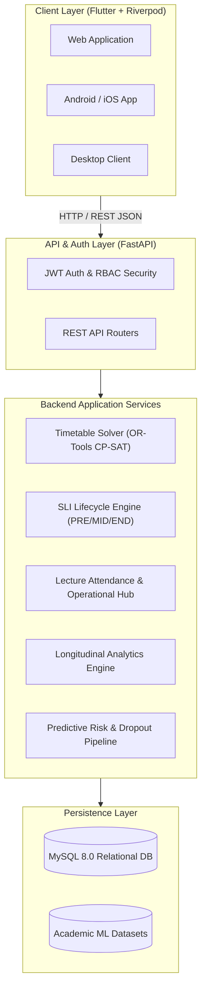

<div align="center">

# 🎓 ENOSIS
### *Every Task. One Solution.*

[](https://fastapi.tiangolo.com)
[](https://flutter.dev)
[](https://www.mysql.com)
[](https://developers.google.com/optimization)
[](https://www.docker.com)
[](backend/tests)

**ENOSIS** is a next-generation, unified academic operations and faculty intelligence platform designed to eliminate institutional friction. It orchestrates intelligent constraint-based timetable scheduling, longitudinal student learning insights (PRE/MID/END), daily lecture attendance execution, and predictive student success analytics into a singular, responsive ecosystem.

---

[Key Modules](#-key-modules) • [System Architecture](#-system-architecture) • [Quick Start](#-quick-start) • [API Directory](#-api-directory) • [Database & Seeding](#-database--seeding) • [Development Workflow](#-development-workflow)

---

</div>

## 🌟 Key Modules

<details open>
<summary><b>1. 🗓️ Intelligent Timetable Optimization Engine (Google OR-Tools CP-SAT)</b></summary>
<br>

- **Automated Constraint Solving**: Generates conflict-free academic timetables across 4 Year levels, multiple divisions (A, B, C), and specialized lab batches.
- **Hard & Soft Constraint Enforcement**: Faculty workload limits, continuous slot constraints, laboratory block reservation, room capacity, and inter-departmental conflict resolution.
- **Dynamic Assignment Upload**: Ingests and validates faculty-subject assignments via Excel/CSV spreadsheets with preview, validation, and auto-mapping.
- **Interactive Multi-View Schedules**: Visual grid displays for division timetables, individual faculty schedules, and master institutional calendars.
</details>

<details open>
<summary><b>2. 📊 Student Learning Insights (SLI) PRE → MID → END Assessment Lifecycle</b></summary>
<br>

- **PRE-Assessment (Baseline & Prerequisite Mapping)**: Gauges prior knowledge, prerequisite confidence, and expectations before instruction begins.
- **MID-Assessment (Formative Progress & Intervention)**: Assesses topic-level pacing, comprehension barriers, learning modalities, and surfaces immediate intervention flags.
- **END-Assessment (Summative Outcome & Attainment)**: Measures total topic mastery, Bloom's taxonomy attainment, and exports competencies for institutional accreditation.
- **Longitudinal Analytics Dashboard**: Student-level and class-level progress charts, attention indicators, and distribution analytics.
</details>

<details open>
<summary><b>3. ⚡ Faculty Operational Hub & Daily Lecture Execution</b></summary>
<br>

- **Smart Teaching Contexts**: Auto-resolves active teaching contexts from valid timetable generation runs, department assignments, and division mappings.
- **One-Click Live Attendance Roster**: Normalized session-level tracking (`lecture_attendance_sessions` + `lecture_attendance_records`) with rapid `PRESENT`, `ABSENT`, and `LATE` toggles.
- **Real-Time Faculty Hub**: Live schedule cards, pending tasks, upcoming lectures, and attendance summary metrics.
</details>

<details>
<summary><b>4. 🎯 UI/UX & Career Advancement</b></summary>
<br>

- **Modern Glassmorphism UI**: Built with Flutter and Riverpod, featuring responsive layouts for Web, Android, and Desktop.
- **Career & Achievements Hub**: Faculty achievement logs, research publication trackers, institutional notices, and profile management.
- **Integrated To-Do & Task Management**: Categorized task planning with priority scheduling and calendar sync.
</details>

<details>
<summary><b>5. 🤖 Predictive Academic Analytics & ML</b></summary>
<br>

- **Dropout & Academic Risk Modeling**: Machine learning pipelines analyzing student historical performance, attendance patterns, and socioeconomic indicators to surface proactive retention warnings.
</details>

---

## 🏗️ System Architecture



---

## 📁 Repository Structure

```text
ENOSIS/
├── backend/                  # FastAPI Application
│   ├── app/
│   │   ├── api/routes/       # Modular API endpoints (auth, timetable, sli, attendance, dashboard)
│   │   ├── core/             # App configuration, security, JWT helpers
│   │   ├── db/               # Database engine, session maker, SQLAlchemy Base
│   │   ├── models/           # Normalized SQLAlchemy 2.0 ORM models
│   │   ├── schemas/          # Pydantic validation schemas (requests & responses)
│   │   ├── services/         # Domain business logic & OR-Tools CP-SAT solvers
│   │   └── sync_and_seed.py  # Automated schema synchronization & dev seed runner
│   ├── tests/                # 123+ automated Pytest unit and integration tests
│   ├── Dockerfile            # Production & dev backend container definition
│   └── requirements.txt      # Python dependencies
│
├── frontend/                 # Flutter Application (Cross-Platform)
│   ├── lib/
│   │   ├── app/              # App routing, themes, and global constants
│   │   ├── core/             # HTTP ApiClient, storage, utilities
│   │   └── features/         # Feature-first modular packages
│   │       ├── auth/         # Login, registration, token persistence
│   │       ├── dashboard/    # Operational Hub, live attendance sheet, widgets
│   │       ├── faculty_insights/ # SLI PRE/MID/END forms, class & student analytics
│   │       ├── timetable/    # Solver config, schedule grids, CSV/Excel uploader
│   │       └── profile/      # Career advancement, achievements, settings
│   ├── test/                 # Widget and provider test suites
│   └── pubspec.yaml          # Flutter package dependencies
│
├── ml/                       # Machine Learning Models & Data
│   ├── data/                 # Student dropout & academic success datasets
│   └── requirements.txt      # ML environment dependencies
│
├── docker-compose.yml        # Multi-container orchestration (FastAPI + MySQL 8.0)
└── README.md                 # Project documentation
```

---

## 🚀 Quick Start

### Prerequisites
- **Python**: 3.11+ / 3.12+
- **Flutter SDK**: 3.24+
- **Docker & Docker Compose** (Recommended for full-stack run)
- **MySQL 8.0+** (if running without Docker)

---

### Option A: Run with Docker Compose (Recommended)

1. **Clone the repository**:
   ```bash
   git clone https://github.com/Guru2025-KIT/ENOSIS-Every-Task-One-Solution-.git
   cd ENOSIS-Every-Task-One-Solution-
   ```

2. **Start Backend & MySQL**:
   ```bash
   docker compose up --build -d
   ```

3. **Initialize Database Schema & Dev Seed Data**:
   ```bash
   docker exec -it enosis-backend python -m app.sync_and_seed
   ```

4. **Launch Frontend**:
   ```bash
   cd frontend
   flutter pub get
   flutter run -d chrome    # Or flutter run -d edge / windows / android
   ```

---

### Option B: Local Manual Setup

#### 1. Backend Setup
```bash
cd backend
python -m venv venv

# Windows
.\venv\Scripts\activate
# Linux/macOS
source venv/bin/activate

pip install -r requirements.txt

# Configure .env with your MySQL credentials, then sync schema & seed
python -m app.sync_and_seed

# Start FastAPI server
uvicorn app.main:app --reload --host 0.0.0.0 --port 8000
```
Interactive API docs will be live at: [http://localhost:8000/docs](http://localhost:8000/docs)

#### 2. Frontend Setup
```bash
cd frontend
flutter pub get
flutter run
```

---

## 🧪 Testing & Verification

The platform maintains 100% test coverage on all core services, integration contracts, and solvers.

### Run Backend Tests
```bash
pytest backend/tests/
```
*Output: `123 passed, 3 skipped in ~60s`*

### Run Frontend Tests & Static Analysis
```bash
cd frontend
flutter analyze
flutter test
```

---

## 📋 API Directory

| Endpoint | Method | Description |
| :--- | :--- | :--- |
| **Authentication** | | |
| `/auth/login` | `POST` | Authenticate user and obtain JWT access token |
| `/auth/register` | `POST` | Register a new faculty / admin account |
| `/auth/me` | `GET` | Get current authenticated user profile |
| **Faculty Operations & Attendance** | | |
| `/api/dashboard/summary` | `GET` | Fetch real-time schedule, stats, and lecture cards |
| `/api/attendance/session` | `GET` | Retrieve attendance session & student roster |
| `/api/attendance/session` | `POST` | Create or update lecture attendance records |
| `/api/attendance/student/{id}/summary` | `GET` | Fetch student aggregate attendance metrics |
| **Student Learning Insights (SLI)** | | |
| `/api/sli/faculty/contexts` | `GET` | Active teaching contexts for logged-in faculty |
| `/api/sli/pre/form/{context_id}` | `GET` | Get PRE-assessment template & questions |
| `/api/sli/pre/submit` | `POST` | Submit student PRE-assessment response |
| `/api/sli/mid/form/{context_id}` | `GET` | Get MID-assessment template & prior scores |
| `/api/sli/mid/submit` | `POST` | Submit student MID-assessment response |
| `/api/sli/end/form/{context_id}` | `GET` | Get END-assessment template & outcome map |
| `/api/sli/end/submit` | `POST` | Submit student END-assessment response |
| `/api/sli/analytics/class/{context_id}` | `GET` | Aggregate class-level longitudinal analytics |
| `/api/sli/analytics/student/{context_id}/{student_id}` | `GET` | Deep-dive student learning trajectory |
| **Timetable Generation** | | |
| `/api/timetable/generate` | `POST` | Trigger OR-Tools CP-SAT timetable solver run |
| `/api/timetable/runs/latest` | `GET` | Retrieve active optimal generation run |
| `/api/timetable/division/{id}` | `GET` | Fetch weekly schedule for a division |

---

## 👥 Default Development Accounts

When seeded using `python -m app.sync_and_seed`:

| Role | Email | Password | Assigned Classes |
| :--- | :--- | :--- | :--- |
| **Faculty / Lead** | `gurushinde@gmail.com` | `admin123` | CS Dept (Year 3 Div A, Distributed Systems) |
| **Faculty / Dev** | `faculty@enosis.edu.in` | `admin123` | CS Dept (Year 3 Div A, Database Systems) |
| **Admin** | `admin@enosis.edu.in` | `admin123` | Full Administrative Privileges |

---

<div align="center">

Made with ❤️ by the **ENOSIS Team**  
*Empowering educators and students through unified, intelligent engineering.*

</div>
