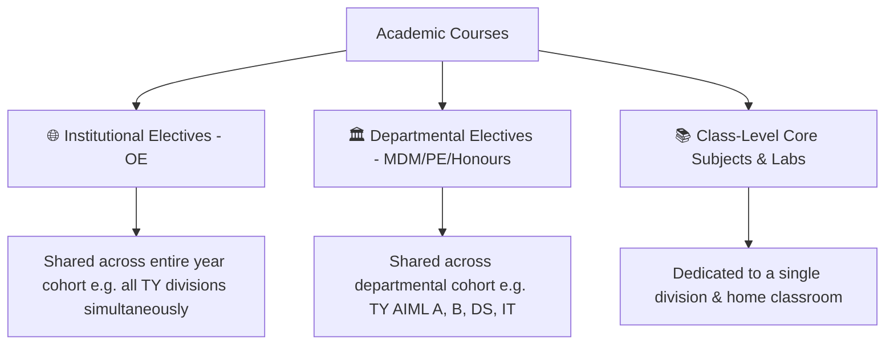
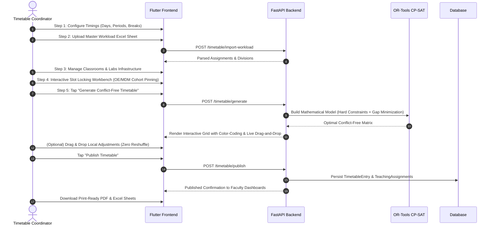

# 📅 ENOSIS Timetable Management & Automated Generation Engine
## Complete Technical & Functional Architecture Guide

---

## 🌟 1. Executive Summary

The **ENOSIS Timetable Module** is an enterprise-grade academic scheduling system engineered for universities and engineering colleges. It eliminates the manual effort, scheduling errors, and teacher/room clashes associated with creating complex multi-departmental schedules.

Built using **Google OR-Tools CP-SAT (Constraint Programming - Satisfiability)** optimization and a **Flutter reactive frontend**, ENOSIS transforms raw faculty workload spreadsheets into conflict-free, compact, and fully customizable academic timetables in seconds.

```
       ┌───────────────────────────────┐
       │   Master Workload Excel Sheet │
       └───────────────┬───────────────┘
                       │
                       ▼
       ┌───────────────────────────────┐
       │  3-Tier Subject Categorizer   │
       │  (Institutional/Dept/Class)   │
       └───────────────┬───────────────┘
                       │
                       ▼
       ┌───────────────────────────────┐
       │  Interactive Slot Workbench   │
       │  (Cohort-Wide Anchor Locking) │
       └───────────────┬───────────────┘
                       │
                       ▼
       ┌───────────────────────────────┐
       │ Google OR-Tools CP-SAT Solver │
       │ (Hard Constraints + Gap Min)  │
       └───────────────┬───────────────┘
                       │
                       ▼
       ┌───────────────────────────────┐
       │ Interactive Drag & Drop Grid  │
       │ (Intelligent Local Conflict)  │
       └───────────────┬───────────────┘
                       │
        ┌──────────────┴──────────────┐
        ▼                             ▼
┌───────────────┐             ┌───────────────┐
│ 1-Click Publish│             │ PDF & Excel   │
│ to Dashboards │             │ Export Engine │
└───────────────┘             └───────────────┘
```

---

## 🏗️ 2. Technology Stack

| Layer | Technologies Used | Key Responsibilities |
|---|---|---|
| **Backend Engine** | Python 3.12, FastAPI, SQLAlchemy | High-speed REST API, schema validation, data serialization |
| **Optimization Engine** | Google OR-Tools CP-SAT Solver | Exact mathematical constraint optimization, branch-and-bound search |
| **Database** | PostgreSQL / SQLite | Relational schema for Divisions, Subjects, Rooms, Faculty, Entries |
| **Frontend UI** | Flutter (Dart 3), Provider | Reactive state management, Draggable/DragTarget grids, custom painters |
| **Export Services** | ReportLab (PDF), OpenPyXL (Excel) | Print-ready multi-page colored timetables with institutional letterheads |

---

## 🧩 3. Core Architectural Pillars

### 3.1. Three-Tier Subject Hierarchy
Academic institutions have diverse course structures. ENOSIS categorizes every subject into one of three structural tiers:



1. **🌐 Institutional Electives (Open Electives / OE)**:
   - Taken across the entire college year (e.g., all TY branches attend OE in the same period).
   - When scheduled or locked in the workbench, ENOSIS **automatically blocks that exact slot across all sibling divisions in the cohort**.
2. **🏛️ Departmental Electives (MDM / PE / B.Tech Honours)**:
   - Shared across department divisions of that specific year.
   - Synchronized across cohort divisions with multi-faculty parallel track support.
3. **📚 Class-Level Core Subjects & Practical Labs**:
   - 1-Hour Theory lectures mapped to the division's assigned **Home Classroom**.
   - 2-Hour contiguous Practical Labs with parallel batch split (`Batch 1`, `Batch 2`, `Batch 3`) mapped to specialized lab rooms.

---

### 3.2. Google OR-Tools CP-SAT Constraint Optimization Engine

The backend solver translates the academic scheduling problem into a mathematical model with Boolean decision variables:

$$\mathbf{x}_{i, j} \in \{0, 1\}$$

where $\mathbf{x}_{i, j} = 1$ indicates that session option $j$ is assigned to academic session $i$.

#### A. Hard Constraints (Enforced 100% Strictly — Zero Clashes Allowed)
1. **No Faculty Clashes**: A professor cannot teach two different classes or batches at the same time:
   $$\sum_{i \in \text{Sessions}(f)} \mathbf{x}_{i, (d, s)} \le 1 \quad \forall \text{faculty } f, \text{day } d, \text{slot } s$$
2. **No Class/Student Double-Booking**: A division cannot have more than one theory lecture at the same time:
   $$\sum_{i \in \text{Theory}(c)} \mathbf{x}_{i, (d, s)} + \mathbf{x}_{\text{LabBatch}(c, b), (d, s)} \le 1$$
3. **No Room Collisions**: A classroom or lab can host at most one session per slot:
   $$\sum_{i \in \text{Sessions}(r)} \mathbf{x}_{i, (d, s)} \le 1 \quad \forall \text{room } r$$
4. **Break & Lunch Slot Preservation**: Mandatory Tea/Breakfast breaks and Lunch intervals are strictly protected across all branches.
5. **2-Hour Contiguous Lab Blocks**: Lab sessions are mathematically constrained to span consecutive hours $[s, s+1]$ without crossing break boundaries.
6. **Cohort Joint Alignment**: Sessions sharing a `joint_group_id` or locked institutional/departmental tags are mathematically bound to identical $(d, s)$ values across all member divisions.

#### B. Optimization Objectives & Schedule Compaction (Elimination of Gaps)
The solver maximizes an objective function balancing comfort, density, and spread:

$$\text{Maximize } \sum \text{Rewards} - \sum \text{Penalties}$$

- **Schedule Compaction (Middle-Gap Elimination)**: The engine detects and severely penalizes empty "holes" where a slot $s$ is free while $s-1$ and $s+1$ are occupied on the same day for a class:
  $$\text{GapVar}_{c, d, s} \ge \mathbf{active}_{c, d, s-1} + \mathbf{active}_{c, d, s+1} - \mathbf{active}_{c, d, s} - 1$$
  $$\text{Penalty} = 450 \times \text{GapVar}_{c, d, s}$$
- **Morning Slot Preference**: Lectures are preferentially packed earlier in the day starting from Period 1.
- **Daily Workload Distribution**: Prevents clustering all weekly theory lectures into 2 exhausting days.
- **Parallel Lab Batch Synchronization**: When `Batch 1` and `Batch 2` of the same class have labs on the same day, they are rewarded (+500 pts) for running concurrently in parallel lab rooms.

---

### 3.3. Interactive Pre-Assignment & Slot Locking Workbench

Before triggering the automated solver, timetable administrators can customize fixed slots visually:

1. **Classify Subjects Modal**: Filter and assign subjects from the workload sheet into Institutional, Departmental, or Class Core categories.
2. **Tray Drag & Drop**: Drag a subject chip from the tray directly into any cell of the weekly schedule grid.
3. **Cohort Multi-Class Sync**:
   - Locking an institutional subject (e.g., *OE*) for `TY AIML A` on *Wednesday Period 3* automatically pins the same slot for `TY AIML B`, `TY DS`, and `TY IT`.
4. **Strict Year/Class Tray Isolation**:
   - Subjects belonging to `SY` are strictly displayed when viewing `SY` classes and hidden from `TY` or `Final Year` screens.
5. **Quick-Add Modal**: Add custom subjects, faculty in-charge, and weekly hours not present in the original spreadsheet.

---

### 3.4. Post-Publish Live Drag & Drop with Intelligent Local Conflict Rebalancer

Unlike standard tools that break schedules when manually edited, ENOSIS features an **Intelligent Local Conflict Resolver**:

```
[User drags Lecture A from (Mon, 2) to (Wed, 3) in Class 1]
                       │
                       ▼
         [Check Other Classes at (Wed, 3)]
                       │
        ┌──────────────┴──────────────┐
        ▼                             ▼
 [No Clashes Found]            [Faculty Clash with Class 2]
        │                             │
        ▼                             ▼
 [Direct Instant Move]         [Resolve Class 2 ONLY]
 [0 other classes affected]    - Swap Class 2's slot into (Mon, 2)
                               - All other 98% classes stay FROZEN!
```

- **Zero Reshuffle**: Moving a slot never triggers a full timetable regeneration.
- **Targeted Reciprocal Swapping**: If Professor X now teaches Class 1 on Wednesday Period 3, but was previously scheduled for Class 2 at that time, ENOSIS automatically shifts Class 2's lecture to Class 1's vacated slot.

---

### 3.5. Accurate Faculty Dashboard & Attendance Isolation

1. **Normalized Strict Faculty Matching**:
   - Faculty names from spreadsheets are matched using normalized equality (`_clean_title(sheet_name) == _clean_title(user_name)`).
   - Empty or unassigned cells (`"-"`, `"TBA"`, `"Staff"`) map to a dedicated system entity (`"Unassigned Faculty"`).
   - **Guaranteed Isolation**: If a faculty member has zero assigned classes in the workload sheet, their Faculty Dashboard will show strictly **0 lectures / 0 labs**.
2. **Real-Time Today's Schedule**:
   - Displays active lectures for the logged-in teacher for the current day index.
   - Live status badges (`COMPLETED` vs `UPCOMING`) linked directly with Student Attendance marking.

---

## 🎨 4. Visual Aesthetics & Design System

The ENOSIS user interface follows a modern palette:

```
┌─────────────────────────────────────────────────────────────┐
│  🎨 ENOSIS Timetable Palette Tokens                         │
├─────────────────────────────────────────────────────────────┤
│  Primary Deep Slate:      #0F172A (Header, Navigation, Dark) │
│  Vibrant Rust Orange:    #EA580C / #F97316 (Accents, Locks) │
│  Navy Ice Blue:          #EFF6FF / #1E3A8A (Core Theory)    │
│  Orange Cream:           #FFF7ED / #C2410C (Institutional)  │
│  Warm Amber:             #FFFBEB / #B45309 (Departmental)   │
│  Slate Silver:           #F8FAFC / #64748B (Practical Labs) │
└─────────────────────────────────────────────────────────────┘
```

- **Visual Badges**: Every grid cell displays categorical badges (`Institutional (OE)`, `Dept Level (MDM)`, `Core Theory`, `2-Hour Lab`).
- **Interactive Feedback**: Drop targets provide visual cues with color shifts (`#FFF7ED`) and tactile borders during drag & drop operations.

---

## 🚀 5. End-to-End User Workflow Guide (5 Streamlined Steps)



---

## 💾 6. Database Schema & Data Models

### 6.1. Entity-Relationship Overview

```mermaid
erDiagram
    DIVISION ||--o{ TIMETABLE_ENTRY : has
    SUBJECT ||--o{ TIMETABLE_ENTRY : teaches
    USER ||--o{ TIMETABLE_ENTRY : assigned_to
    ROOM ||--o{ TIMETABLE_ENTRY : scheduled_in
    TEACHING_ASSIGNMENT ||--o{ USER : faculty
    TEACHING_ASSIGNMENT ||--o{ SUBJECT : subject
    TEACHING_ASSIGNMENT ||--o{ DIVISION : class

    DIVISION {
        string id PK
        string name
        string division_code
        int year
    }

    SUBJECT {
        string id PK
        string name
        string code
        int weekly_lectures
        boolean is_lab
    }

    ROOM {
        string id PK
        string name
        string type
        int capacity
    }

    TIMETABLE_ENTRY {
        string id PK
        string batch_id
        string division_id FK
        string subject_id FK
        string faculty_id FK
        string room_id FK
        int day
        int slot
        boolean is_lab_block
        string batch_name
        string session_type
    }

    TEACHING_ASSIGNMENT {
        string id PK
        string faculty_id FK
        string subject_id FK
        string division_id FK
        string session_type
        int weekly_count
        string batch_name
        string joint_group_id
    }
```

---

## 📡 7. API Reference Summary

| Endpoint | Method | Purpose |
|---|---|---|
| `/timetable/schedule-config` | `GET / POST` | Read and update working days, period timings, break durations |
| `/timetable/generate` | `POST` | Execute Google OR-Tools CP-SAT multi-stage timetable solver |
| `/timetable/publish` | `POST` | Persist and publish generated timetable to all faculty dashboards |
| `/timetable/published` | `GET` | Retrieve published timetable with filtering by Class, Faculty, or Room |
| `/timetable/export-pdf` | `POST` | Generate high-res printable PDF with institutional branding |
| `/timetable/export-excel` | `POST` | Generate multi-tab styled Excel workbook |
| `/faculty/dashboard` | `GET` | Fetch personalized daily schedule for logged-in faculty member |

---

## 📋 8. Key Differentiators

1. **Mathematically Guaranteed Conflict-Free**: Google OR-Tools guarantees zero faculty, classroom, lab, or class overlap.
2. **Dense & Compact Student Schedules**: Integrated gap-minimization objective eliminates awkward middle-of-the-day free hours.
3. **Cohort Synchronization**: Automatic alignment for Institutional (OE) and Departmental (MDM) electives across whole year cohorts.
4. **Non-Destructive Post-Publish Drag & Drop**: Adjust individual lectures without reshuffling or corrupting the rest of the schedule.
5. **Clean Faculty Dashboard Isolation**: Absolute isolation ensuring teachers only see their own verified classes.
6. **Print-Ready Exports**: Instant export to styled PDF and Excel files.

---
*Created for the ENOSIS Academic Management Platform.*
